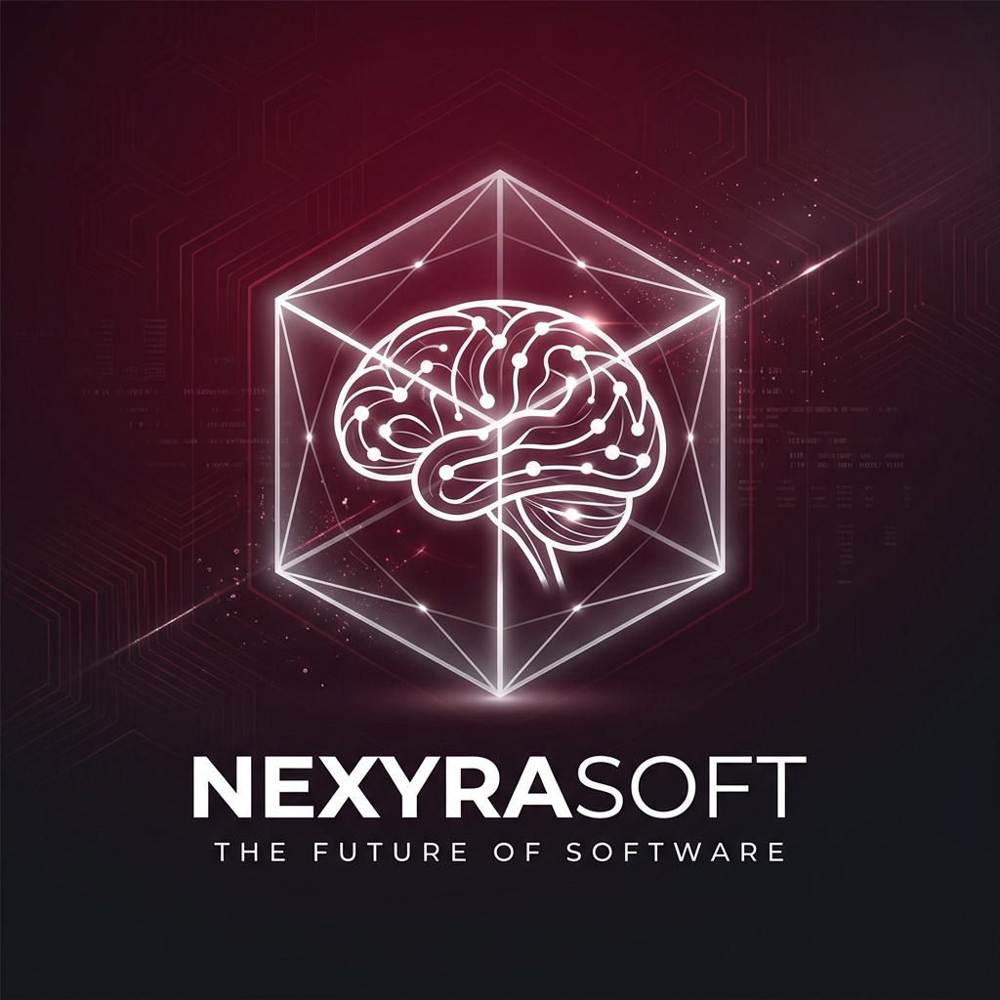

<div align="center">
  

  # NexyraSoft
  ### Premium Digital Solutions & Strategic IT Excellence

  [](https://vitejs.dev/)
  [](https://reactjs.org/)
  [](https://tailwindcss.com/)
  [](https://threejs.org/)
  [](https://expressjs.com/)
  [](https://www.mongodb.com/)
  [](https://www.docker.com/)
</div>

---

## 🚀 Overview

**NexyraSoft** is a state-of-the-art digital presence for a premium IT solutions provider. Built with a focus on immersive user experience and robust enterprise architecture, it seamlessly integrates high-performance 3D visuals with a powerful Node.js/Express backend.

This platform serves as both a high-conversion marketing engine (capturing leads and showcasing case studies) and a comprehensive operational dashboard for managing content, careers, and user interactions.

## ✨ Key Features

- **🎨 Immersive UI/UX**: Built with React 19 and Tailwind CSS 4, featuring smooth Framer Motion animations and premium aesthetics.
- **🌐 3D Visual Experience**: Integrated Three.js and React Three Fiber for dynamic, interactive background geometries.
- **🔒 Secure Architecture**: Robust JWT-based authentication with role-based access control for the administrative dashboard.
- **📊 CRM-Ready Backend**: Automated lead capture system that stores submissions in MongoDB and triggers real-time email notifications via SMTP.
- **🏢 Managed Career Portal**: Dynamic vacancy management system allowing admins to post and manage job opportunities.
- **💬 Real-time Engagement**: Integrated chatbox and consultation booking system to drive client acquisition.
- **🐳 DevOps Ready**: Fully containerized with Docker and Docker Compose for seamless deployment and environment consistency.

## 🛠️ Tech Stack

### Frontend
- **Framework**: React 19 (Vite)
- **Styling**: Tailwind CSS 4, Shadcn UI
- **Animations**: Motion (Framer Motion)
- **3D Graphics**: Three.js, React Three Fiber, React Three Drei
- **Icons**: Lucide React

### Backend
- **Runtime**: Node.js
- **Framework**: Express.js (TypeScript)
- **Database**: MongoDB (Mongoose ODM)
- **Security**: JWT (JSON Web Tokens), Bcrypt.js
- **Communications**: Nodemailer (SMTP Integration)

## 🛠️ Getting Started

### Prerequisites
- [Node.js](https://nodejs.org/) (v18+ recommended)
- [MongoDB](https://www.mongodb.com/try/download/community) (Local instance or Atlas URI)
- [Docker](https://www.docker.com/) (Optional, for containerized setup)

### Local Development

1. **Clone the repository:**
   ```bash
   git clone https://github.com/NexyraSoft/nexyrasoft.git
   cd nexyrasoft
   ```

2. **Install dependencies:**
   ```bash
   npm install
   ```

3. **Configure Environment Variables:**
   Create a `.env` file in the root directory based on `.env.example`:
   ```env
   PORT=5000
   MONGODB_URI=mongodb://127.0.0.1:27017/nexyrasoft
   JWT_SECRET=your_super_secret_key
   VITE_API_URL=http://localhost:5000/api
   # ... add SMTP settings for email functionality
   ```

4. **Run the application:**
   
   In terminal 1 (Backend):
   ```bash
   npm run server:dev
   ```
   
   In terminal 2 (Frontend):
   ```bash
   npm run dev
   ```

### 🐳 Running with Docker

Easily spin up the entire stack (Frontend + Backend + MongoDB) using Docker Compose:

```bash
docker-compose up --build
```

The app will be accessible at `http://localhost:3000`.

## 📁 Project Structure

```text
nexyrasoft/
├── server/               # Express Backend (TypeScript)
│   ├── src/
│   │   ├── controllers/  # Business logic
│   │   ├── models/       # Mongoose schemas
│   │   └── routes/       # API endpoints
├── src/                  # React Frontend
│   ├── components/       # UI Components (Sections, Layout)
│   ├── lib/              # API helpers & utilities
│   └── styles/           # CSS & Tailwind configuration
├── Dockerfile            # Container definition
└── docker-compose.yml    # Multi-container orchestration
```

## 📝 License

This project is licensed under the MIT License - see the [LICENSE](LICENSE) file for details.

---

<div align="center">
  Built with ❤️ by <b>NexyraSoft Team</b>
</div>
